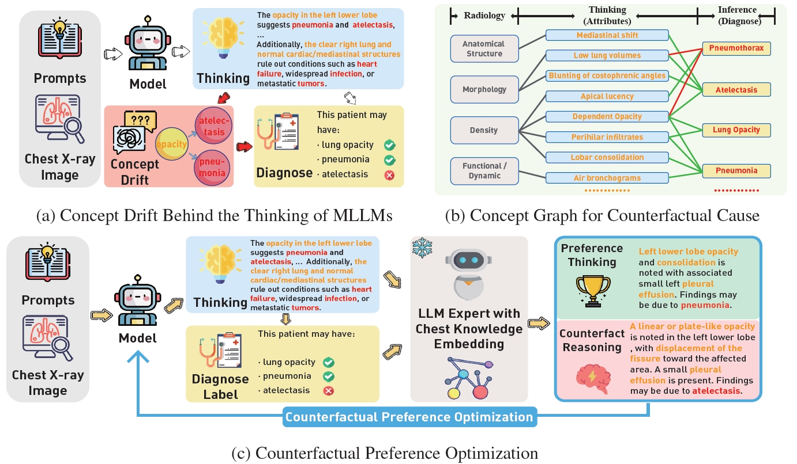

# Counterfactual Preference Optimization (CPO)

This repository is a PyTorch implementation of resilient contrastive learning proposed in *Walking the Tightrope: Disentangling Beneficial and Detrimental Drifts in Non-Stationary Custom-Tuning* (submitted)


This paper uncovers a critical yet overlooked phenomenon in multi-modal large language models (MLLMs): detrimental concept drift within chain-of-thought (CoT) reasoning during non-stationary reinforcement fine-tuning (RFT), where reasoning token distributions evolve unpredictably, thereby introducing significant biases in final predictions. To address this, we are pioneers in establishing the theoretical bridge between concept drift theory and RFT processes by formalizing CoT's autoregressive token streams as non-stationary distributions undergoing arbitrary temporal shifts. Leveraging this framework, we propose a novel counterfact-aware RFT that systematically decouples beneficial distribution adaptation from harmful concept drift through concept graph-empowered LLM experts generating counterfactual reasoning trajectories. Our solution, Counterfactual Preference Optimization (CPO), enables stable RFT in non-stationary environments, particularly within the medical domain, through custom-tuning of counterfactual-aware preference alignment. Extensive experiments demonstrate our superior performance of robustness, generalization and coordination within RFT. Besides, we also contributed a large-scale dataset CXR-CounterFact (CCF), comprising 320,416 meticulously curated counterfactual reasoning trajectories derived from MIMIC-CXR. Our code and data are public.

The code in this repo is copied/modified from [Qwen2.5-VL](https://github.com/QwenLM/Qwen2.5-VL).




The main contributions of our methods. 
- (a) By formalizing autoregressive CoT generation as a stream of next-token prediction actions under the theoretical lens of concept drift, we reveal that even minor perturbations in reinforced fine-tuning can induce unpredictable distributional changes of final predicted results. 
- (b) To disentangle detrimental drift, we introduce the concept graph that generates radiologically plausible counterfactual CoTs through controlled attribute perturbations. Green lines represent attributes that are positively correlated with the disease, while red denote they are exclusive. 
- (c) We propose counterfactual preference optimization to drive the reinforced custom-tuning of MLLMs, enabling generalized CoT reasoning in non-stationary environments through disentanglement of beneficial domain adaptation from spurious concept drift, thereby achieving robust human-aligned decision-making via preference distillation.

------------------------------------------

## Training

The supervised-fining (SFT) and reinforced fine-tuning (RFT) are supported by [ms-swift](https://github.com/modelscope/ms-swift)

To supervised-fine the Qwen2.5-VL with multi-node distributed training, run the following with 2 GPUs:

```bash
nohup bash SFT-Qwen2.5.sh > sft.log 2>&1 &
```

To reinforced fine-tune the Qwen2.5-VL with multi-node distributed training, run the following with 2 GPUs:


```bash
nohup bash CPO-Qwen2.5.sh > cpo.log 2>&1 &
```

## CXR-CounterFact (CCF) Dataset


Since we are pioneers in introducing counterfactual cause into reinforced custom-tuning of MLLMs, we are deeply aware of the scarcity of counterfactual CoT in downstream tasks, especially in the highly professional medical field. Thus, our aspiration is for the model to adeptly acclimate to the concept drift by itself, acquiring abundant knowledge with more and more data, but not exhibiting bias.

In this context, a more realistic training dataset for multi-modal large language models is required to validate their potential to be trained under the non-stationary reinforced custom-tuning. Recognizing the demand for higher-quality multi-modal data with CoT, we develop a datasets called CXR-CounterFact Dataset (CCF), extending the [MIMIC-CXR](https://physionet.org/content/mimic-cxr/2.1.0/) with counterfactual chain-of-thought. This novel dataset introduces 320,416 meticulously curated counterfactual pairs spanning 14 thoracic pathologies, establishing a pioneering large-scale benchmark for causal interpretation in clinical chest X-ray analysis.


We have upload this dataset on [huggingface](https://huggingface.co/datasets/MiaoMiaoYang/CXR-CounterFact), you can download using this command:

```bash
git clone https://huggingface.co/datasets/MiaoMiaoYang/CXR-CounterFact
```